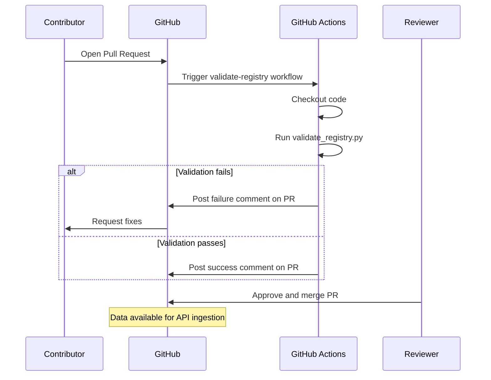
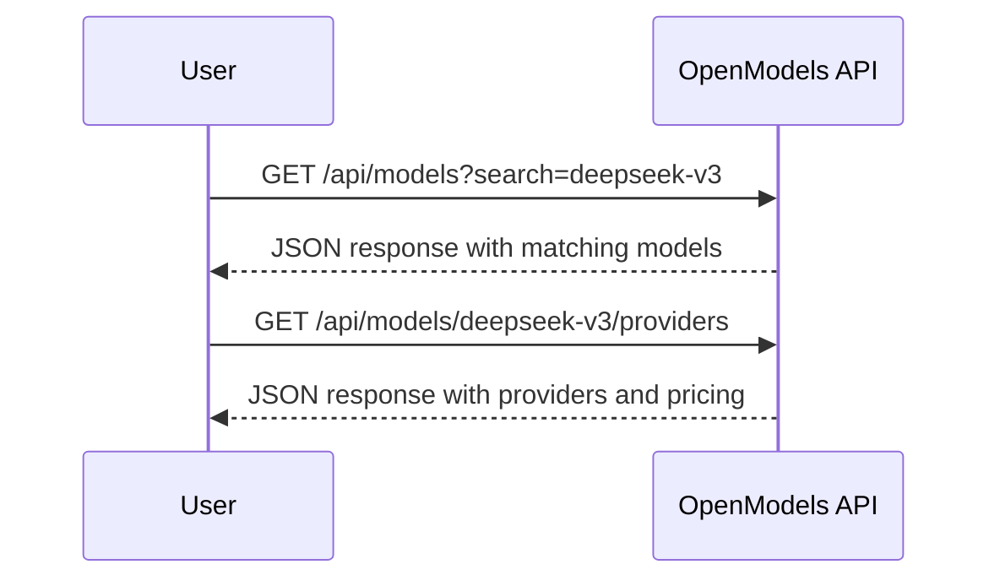
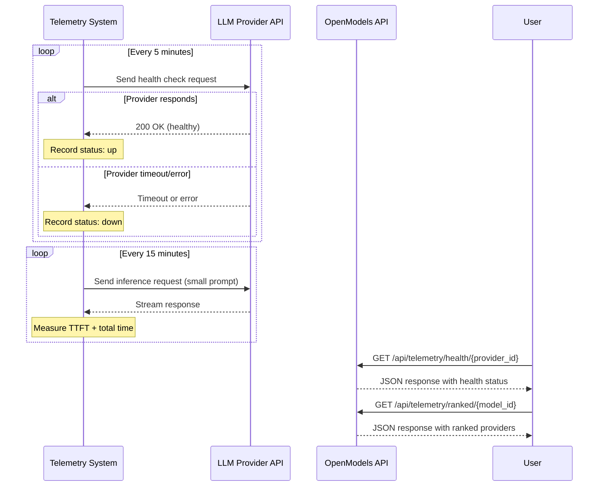
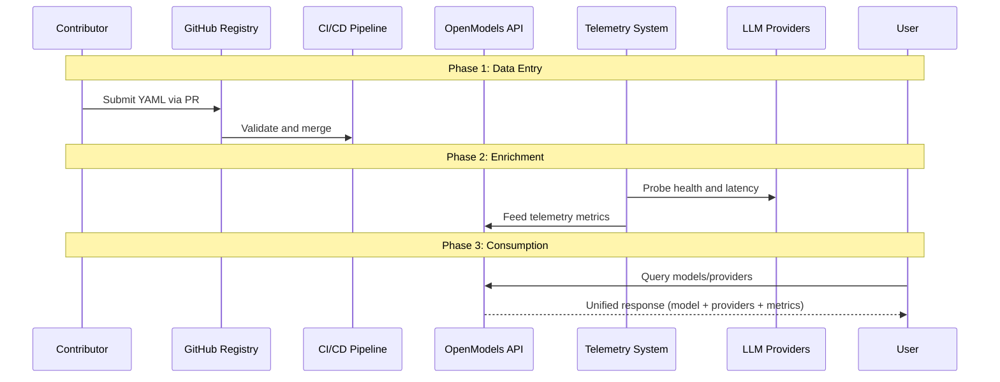

# Data Flow

This page describes the primary data flows in OpenModels — how data moves from community contributions through validation into the registry, how users discover models via the API, and how telemetry is collected from providers.

## Registry Contribution Flow

When a contributor adds or updates a model, provider, or mapping in the registry, the following sequence occurs:

### Validation Steps

The validation pipeline performs the following checks on every pull request:

| Step | Check | Failure Behavior |
|------|-------|-----------------|
| 1 | YAML syntax parsing | Rejects malformed YAML files |
| 2 | JSON Schema validation | Rejects files that don't match schema definitions |
| 3 | Referential integrity | Rejects mappings referencing non-existent models or providers |
| 4 | Duplicate detection | Rejects duplicate model or provider IDs |

## Model Discovery Flow

When a user searches for models or retrieves model details through the API:

### API Endpoints

| Endpoint Pattern | Description |
|-----------------|-------------|
| `/api/models` | List and search models with filtering |
| `/api/models/{id}` | Get full model details |
| `/api/models/{id}/providers` | List providers for a model with pricing |
| `/api/models/{id}/compare` | Compare providers side-by-side |
| `/api/models/popular` | Popular models ranked by relevance |
| `/api/providers` | List all providers |
| `/api/search` | Unified search across models and providers |
| `/api/telemetry/*` | Provider health and latency data |

## Telemetry Collection Flow

The telemetry system continuously monitors provider health and latency:

### Telemetry Metrics

| Metric | Collection Interval | Retention |
|--------|-------------------|-----------|
| **Health status** | Every 5 minutes | 30 days |
| **Time to first token (TTFT)** | Every 15 minutes | 30 days |
| **Total response time** | Every 15 minutes | 30 days |
| **Availability (uptime %)** | Computed from health records | Rolling 7 days |

### Provider Ranking Algorithm

When a user requests ranked providers for a model via `GET /api/telemetry/ranked/{model_id}`, the API computes a composite score:

| Factor | Weight | Source |
|--------|--------|--------|
| Uptime percentage (7-day rolling) | 40% | Health probe records |
| Median latency (TTFT) | 30% | Latency probe records |
| Price per million tokens | 20% | Registry mapping data |
| Median total response time | 10% | Latency probe records |

## End-to-End Data Lifecycle

The complete lifecycle of data in OpenModels from contribution to user consumption:

## Related Pages

- [Architecture Overview](/architecture/overview) — High-level system architecture and component descriptions
- [Schemas](/architecture/schemas) — YAML schema definitions for models, providers, and mappings
