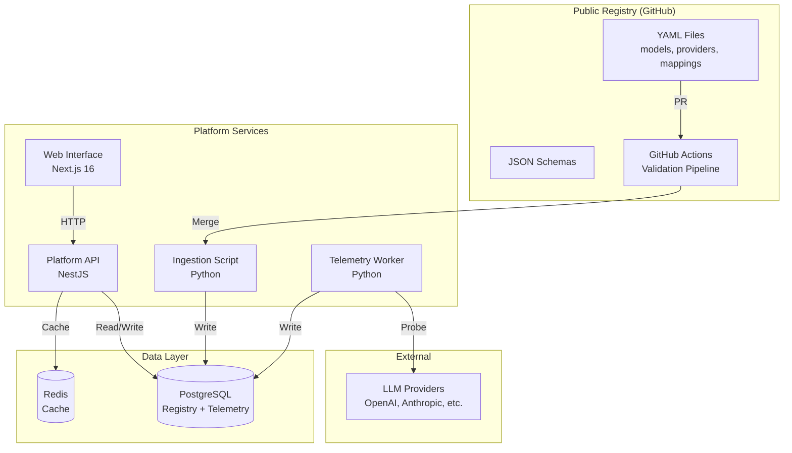

# System Architecture Overview

OpenModels is a hybrid infrastructure layer for discovering, validating, and comparing LLM models and inference providers. The system follows a **registry-first, model-centric architecture** where:

- **Open Registry** — YAML files in a public GitHub repository serve as the single source of truth for models, providers, and mappings
- **Proprietary Platform** — Internal services provide telemetry, analytics, search, and a web interface
- **Model-Centric Design** — Users search for canonical models (e.g., `deepseek-v3`, `qwen3-coder`) and discover which providers offer them

## High-Level Architecture



## Key Design Principles

| Principle | Description |
|-----------|-------------|
| **Registry as Source of Truth** | All model, provider, and mapping data originates from validated YAML files |
| **Validation-First** | Automated validation prevents invalid data from entering the system |
| **Performance Through Caching** | Redis caching reduces database load and improves response times |
| **Observability** | Comprehensive telemetry tracks provider health, latency, and availability |
| **Developer Experience** | Clear APIs, interactive documentation, and intuitive web interface |

## Technology Stack

| Component | Technology | Justification |
|-----------|-----------|---------------|
| **Registry** | YAML + JSON Schema | Human-readable, version-controlled, schema-validated |
| **Validation** | GitHub Actions + Python | Automated CI/CD, native GitHub integration |
| **Platform API** | NestJS (TypeScript) | Type-safe, modular, excellent OpenAPI support |
| **Web Interface** | Next.js 16 (React) | SSR/SSG for SEO, App Router, modern DX |
| **Telemetry Worker** | Python + Celery | Async task execution, robust scheduling |
| **Database** | PostgreSQL 15+ | JSONB support, full-text search, reliability |
| **Cache** | Redis 7+ | High-performance caching, pub/sub for invalidation |
| **API Documentation** | OpenAPI 3.1 + Swagger UI | Interactive docs, code generation support |

## System Components

### 1. Public Registry

The registry is a public GitHub repository containing YAML definitions for all models, providers, and mappings. It serves as the canonical source of truth for the entire platform.

```
openmodels/
├── models/           # Model definitions (e.g., deepseek-v3.yaml)
├── providers/        # Provider definitions (e.g., openai.yaml)
├── mappings/         # Model-to-provider mappings with pricing
│   ├── openai/
│   ├── anthropic/
│   └── ...
└── schemas/          # JSON Schema definitions for validation
```

### 2. Validation Pipeline

A GitHub Actions workflow that runs on every pull request to the registry:

1. **YAML Syntax** — Validates that all files are parseable YAML
2. **Schema Validation** — Checks files against JSON Schema definitions
3. **Referential Integrity** — Ensures mappings reference existing models and providers
4. **Duplicate Detection** — Prevents duplicate model or provider IDs

### 3. Ingestion Script

A Python script triggered on merge to main that loads registry data into PostgreSQL:

- Uses upsert logic (`INSERT ... ON CONFLICT UPDATE`) for idempotent operations
- Maintains transaction boundaries for data consistency
- Invalidates affected Redis cache keys after updates

### 4. Platform API

A NestJS REST API providing model/provider discovery and telemetry endpoints:

| Method | Endpoint | Description |
|--------|----------|-------------|
| GET | `/api/models` | List models with filtering and search |
| GET | `/api/models/{id}` | Get model details |
| GET | `/api/models/{id}/providers` | List providers for a model |
| GET | `/api/models/{id}/compare` | Compare providers for a model |
| GET | `/api/models/popular` | Popular models ranked by relevance |
| GET | `/api/providers` | List all providers |
| GET | `/api/providers/{id}` | Get provider details |
| GET | `/api/stats` | Platform statistics (counts + last sync) |
| GET | `/api/search` | Unified search across models and providers |
| GET | `/api/search/index` | Lightweight search index for client-side use |
| GET | `/api/telemetry/health/{provider_id}` | Provider health status |
| GET | `/api/telemetry/latency/{provider_id}` | Provider latency metrics |
| GET | `/api/telemetry/ranked/{model_id}` | Ranked providers by performance |
| GET | `/api/health` | System health check |

### 5. Telemetry Worker

A Python Celery worker that monitors provider health and latency:

- **Health probes** — Every 5 minutes, checks provider API availability
- **Latency probes** — Every 15 minutes, measures time-to-first-token and total response time
- Results are stored in PostgreSQL and exposed via the Platform API

### 6. Web Interface

A Next.js 16 application providing a user-facing interface for:

- Searching and browsing models with sort options (name, recency, context window, provider count)
- Comparing providers side-by-side (pricing, latency, uptime)
- Viewing real-time telemetry dashboards
- Command Palette (`Cmd+K` / `Ctrl+K`) for instant global search
- Popular models section with relevance-based ranking
- Interactive ecosystem visualization (node graph)
- Provider logo marquee and category-based navigation

### 7. Caching Layer

Redis provides high-performance caching with key-based invalidation:

- **Model/Provider queries** — 5 minute TTL
- **Telemetry data** — 1 minute TTL
- **Pattern-based invalidation** — When data changes, affected cache keys are cleared

## System Boundaries

### In Scope

- Registry management (YAML files, schemas, validation)
- Data ingestion pipeline (YAML → PostgreSQL)
- REST API for model/provider discovery and comparison
- Telemetry collection (health probes, latency monitoring)
- Web interface for browsing and comparing models
- Caching layer for performance optimization

### Out of Scope

- Actual LLM inference (delegated to providers)
- User authentication and authorization (future phase)
- Billing and payment processing
- Model fine-tuning or training

## Related Pages

- [Data Flow](/architecture/data-flow) — Detailed sequence diagrams for registry contributions and model discovery
- [Schemas](/architecture/schemas) — YAML schema definitions for models, providers, and mappings
