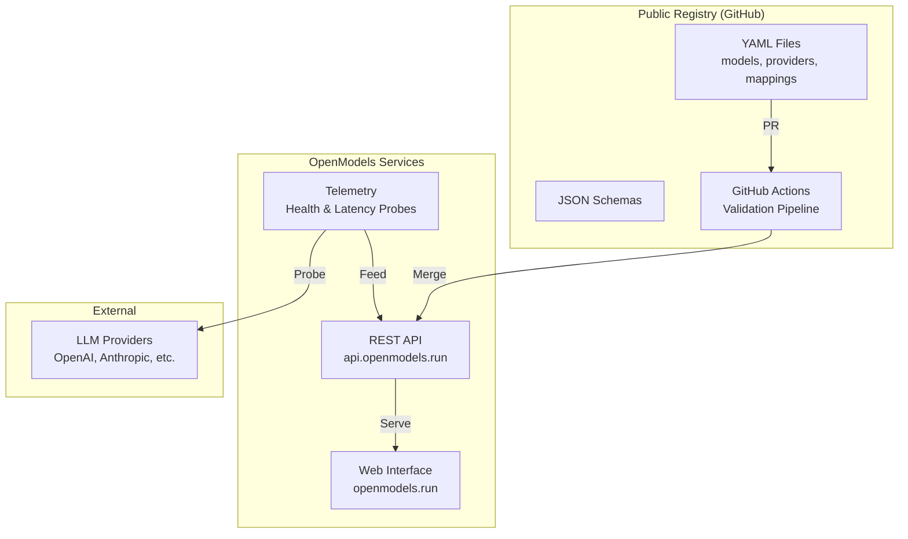

# System Architecture Overview

OpenModels is built around a **registry-first, model-centric architecture** where:

- **Open Registry** — YAML files in a public GitHub repository serve as the single source of truth for models, providers, and mappings
- **Public API** — A REST API at `api.openmodels.run` provides model discovery, comparison, and telemetry data
- **Model-Centric Design** — Users search for canonical models (e.g., `deepseek-v3`, `qwen3-coder`) and discover which providers offer them

## High-Level Architecture



## Key Design Principles

| Principle | Description |
|-----------|-------------|
| **Registry as Source of Truth** | All model, provider, and mapping data originates from validated YAML files |
| **Validation-First** | Automated validation prevents invalid data from entering the system |
| **Observability** | Telemetry tracks provider health, latency, and availability |
| **Developer Experience** | Clear APIs, interactive documentation, and intuitive web interface |

## System Components

### 1. Public Registry

The registry is a public GitHub repository containing YAML definitions for all models, providers, and mappings. It serves as the canonical source of truth.

```
openmodels/
├── models/           # Model definitions (e.g., deepseek-v3.yaml)
├── providers/        # Provider definitions (e.g., openai.yaml)
├── mappings/         # Model-to-provider mappings with pricing
│   ├── openai/
│   ├── anthropic/
│   └── ...
└── schemas/          # JSON Schema definitions for validation
```

### 2. Validation Pipeline

A GitHub Actions workflow that runs on every pull request to the registry:

1. **YAML Syntax** — Validates that all files are parseable YAML
2. **Schema Validation** — Checks files against JSON Schema definitions
3. **Referential Integrity** — Ensures mappings reference existing models and providers
4. **Duplicate Detection** — Prevents duplicate model or provider IDs

### 3. REST API

The public API at `api.openmodels.run` provides model/provider discovery and telemetry endpoints:

| Method | Endpoint | Description |
|--------|----------|-------------|
| GET | `/api/models` | List models with filtering and search |
| GET | `/api/models/{id}` | Get model details |
| GET | `/api/models/{id}/providers` | List providers for a model |
| GET | `/api/models/{id}/compare` | Compare providers for a model |
| GET | `/api/models/popular` | Popular models ranked by relevance |
| GET | `/api/providers` | List all providers |
| GET | `/api/providers/{id}` | Get provider details |
| GET | `/api/stats` | Registry statistics (counts + last sync) |
| GET | `/api/search` | Unified search across models and providers |
| GET | `/api/search/index` | Lightweight search index for client-side use |
| GET | `/api/telemetry/health/{provider_id}` | Provider health status |
| GET | `/api/telemetry/latency/{provider_id}` | Provider latency metrics |
| GET | `/api/telemetry/ranked/{model_id}` | Ranked providers by performance |
| GET | `/api/health` | System health check |

### 4. Telemetry

Automated monitoring of provider health and latency:

- **Health probes** — Every 5 minutes, checks provider API availability (accepts 401/403 as reachable)
- **Latency probes** — Every 15 minutes, measures time-to-first-token and total response time via streaming inference
- **Probe policies** — Per-provider configuration with daily limits and cost controls
- **Data retention** — 30 days of historical telemetry data
- Results are exposed via the API's telemetry endpoints and used for provider ranking

### 5. Web Interface

The web interface at [openmodels.run](https://openmodels.run) provides:

- Searching and browsing models with sort options (name, recency, context window, provider count)
- Comparing providers side-by-side (pricing, latency, uptime)
- Viewing real-time telemetry dashboards
- Command Palette (`Cmd+K` / `Ctrl+K`) for instant global search
- Popular models section with relevance-based ranking
- Interactive ecosystem visualization (node graph)

## System Boundaries

### In Scope

- Registry management (YAML files, schemas, validation)
- REST API for model/provider discovery and comparison
- Telemetry collection (health probes, latency monitoring, provider ranking)
- Web interface for browsing and comparing models
- CMS-powered Insights content platform
- Rate limiting and API access controls

### Out of Scope

- Actual LLM inference (delegated to providers)
- User authentication and personalization (planned for v3)
- Billing and payment processing
- Model fine-tuning or training

## Related Pages

- [Data Flow](/architecture/data-flow) — Detailed sequence diagrams for registry contributions and model discovery
- [Schemas](/architecture/schemas) — YAML schema definitions for models, providers, and mappings
