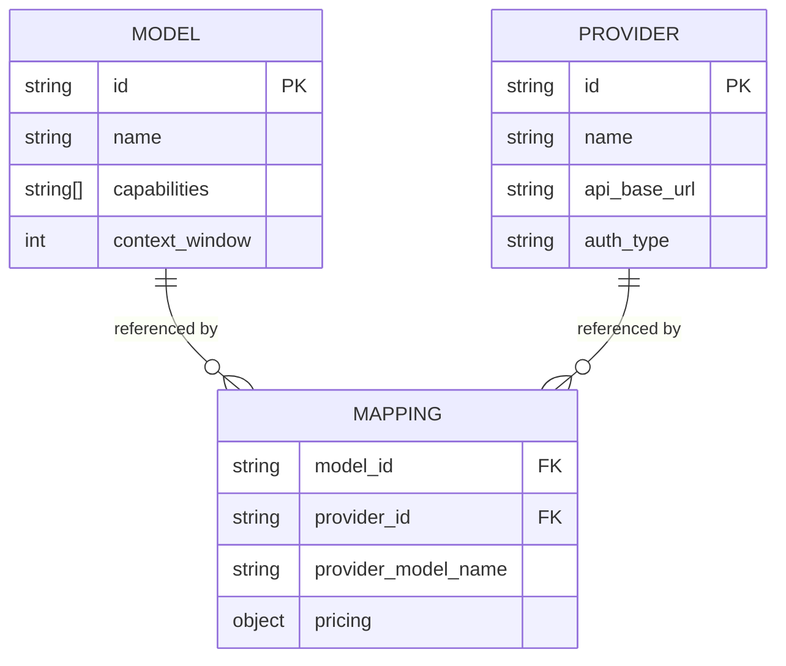

# YAML Schemas

The OpenModels registry uses three core YAML schemas to define the relationships between AI models, inference providers, and their mappings. Each schema is validated automatically via GitHub Actions on every pull request.

## Registry Structure

```
openmodels/
├── models/           # One file per canonical model
│   ├── gpt-5.yaml
│   ├── claude-sonnet-4-5.yaml
│   └── deepseek-v3.yaml
├── providers/        # One file per inference provider
│   ├── openai.yaml
│   ├── anthropic.yaml
│   └── google.yaml
└── mappings/         # Grouped by provider, one file per model offering
    ├── anthropic/
    │   └── claude-sonnet-4-5.yaml
    ├── deepseek/
    │   └── deepseek-v3.yaml
    └── openai/
        └── gpt-5.yaml
```

---

## Model Schema

A model represents a canonical AI model independent of any provider. The filename must match the `id` field (e.g., `claude-sonnet-4-5.yaml`).

### Example

```yaml
id: claude-sonnet-4-5
name: Claude Sonnet 4.5
description: >-
  Anthropic's previous-generation balanced model with strong coding
  and analysis capabilities. Offers excellent price-performance ratio
  for production workloads requiring reliable quality.
capabilities:
  - chat
  - completion
  - function-calling
  - vision
  - code-generation
  - reasoning
modalities:
  - text
  - image
  - code
context_window: 200000
licensing: proprietary
created_at: "2025-10-01T00:00:00.000Z"
updated_at: "2026-05-01T00:00:00.000Z"
```

### Fields

| Field | Type | Required | Description |
|-------|------|----------|-------------|
| `id` | string | Yes | Unique identifier for the model. Must match the filename. |
| `name` | string | Yes | Human-readable display name. |
| `description` | string | Yes | Brief description of the model's capabilities and positioning. |
| `capabilities` | string[] | Yes | List of supported capabilities (see values below). |
| `modalities` | string[] | Yes | Input/output modalities the model supports. |
| `context_window` | integer | Yes | Maximum context window size in tokens. |
| `licensing` | string | Yes | License type: `proprietary`, `open-source`, `open-weights`, or `other`. |
| `created_at` | string (ISO 8601) | Yes | Timestamp when the model was added to the registry. |
| `updated_at` | string (ISO 8601) | Yes | Timestamp of the last update to this entry. |

### Capability Values

| Value | Description |
|-------|-------------|
| `chat` | Multi-turn conversational interaction |
| `completion` | Single-turn text completion |
| `function-calling` | Structured tool/function invocation |
| `vision` | Image understanding and analysis |
| `audio` | Audio input processing |
| `code-generation` | Specialized code writing and editing |
| `reasoning` | Extended chain-of-thought reasoning |

### Modality Values

| Value | Description |
|-------|-------------|
| `text` | Text input and output |
| `image` | Image input (vision) |
| `audio` | Audio input |
| `code` | Code-specific input/output |

---

## Provider Schema

A provider represents an inference API endpoint that serves one or more models. The filename must match the `id` field (e.g., `anthropic.yaml`).

### Example

```yaml
id: anthropic
name: Anthropic
description: >-
  AI safety company providing API access to the Claude family of models,
  known for helpfulness, harmlessness, and honesty with strong reasoning
  and analysis capabilities.
api_base_url: https://api.anthropic.com/v1
auth_type: api-key
regions:
  - us-east-1
  - eu-west-1
compatibility: anthropic
created_at: "2024-01-01T00:00:00.000Z"
updated_at: "2024-06-15T00:00:00.000Z"
```

### Fields

| Field | Type | Required | Description |
|-------|------|----------|-------------|
| `id` | string | Yes | Unique identifier for the provider. Must match the filename. |
| `name` | string | Yes | Human-readable display name. |
| `description` | string | Yes | Brief description of the provider and its offerings. |
| `api_base_url` | string (URL) | Yes | Base URL for the provider's API. |
| `auth_type` | string | Yes | Authentication method: `api-key`, `bearer`, or `oauth2`. |
| `regions` | string[] | Yes | Available deployment regions. |
| `compatibility` | string | Yes | API compatibility format (e.g., `openai`, `anthropic`, `google`). |
| `created_at` | string (ISO 8601) | Yes | Timestamp when the provider was added to the registry. |
| `updated_at` | string (ISO 8601) | Yes | Timestamp of the last update to this entry. |

### Auth Type Values

| Value | Description |
|-------|-------------|
| `api-key` | API key passed via custom header (e.g., `x-api-key`) |
| `bearer` | Bearer token in the `Authorization` header |
| `oauth2` | OAuth 2.0 token exchange flow |

---

## Mapping Schema

A mapping connects a model to a specific provider, including pricing, rate limits, and regional availability. Files are organized under `mappings/{provider_id}/{model_id}.yaml`.

### Example

```yaml
model_id: claude-sonnet-4-5
provider_id: anthropic
provider_model_name: claude-sonnet-4-5-20251001
pricing:
  input_per_million: 3.0
  output_per_million: 15.0
  currency: USD
  cache_write_per_million: 0.75
  cache_read_per_million: 0.30
rate_limits:
  requests_per_minute: 100
  tokens_per_minute: 200000
context_window_override: null
available_regions:
  - us-east-1
  - eu-west-1
created_at: "2025-10-01T00:00:00.000Z"
updated_at: "2026-05-01T00:00:00.000Z"
```

### Fields

| Field | Type | Required | Description |
|-------|------|----------|-------------|
| `model_id` | string | Yes | References an existing model `id` in `models/`. |
| `provider_id` | string | Yes | References an existing provider `id` in `providers/`. |
| `provider_model_name` | string | Yes | The provider's internal model identifier used in API calls. |
| `pricing` | object | Yes | Pricing details (see sub-fields below). |
| `rate_limits` | object | Yes | Rate limit configuration. |
| `context_window_override` | integer \| null | No | Override the model's default context window for this provider. `null` means use the model default. |
| `available_regions` | string[] | Yes | Regions where this model is available from this provider. |
| `created_at` | string (ISO 8601) | Yes | Timestamp when the mapping was added. |
| `updated_at` | string (ISO 8601) | Yes | Timestamp of the last update. |

### Pricing Fields

| Field | Type | Required | Description |
|-------|------|----------|-------------|
| `input_per_million` | number | Yes | Cost per million input tokens in the specified currency. |
| `output_per_million` | number | Yes | Cost per million output tokens. |
| `currency` | string | Yes | ISO 4217 currency code (typically `USD`). |
| `cache_write_per_million` | number | No | Cost per million tokens for prompt cache writes. |
| `cache_read_per_million` | number | No | Cost per million tokens for prompt cache reads. |
| `image_per_unit` | number | No | Cost per image input unit (for vision models). |

### Rate Limit Fields

| Field | Type | Required | Description |
|-------|------|----------|-------------|
| `requests_per_minute` | integer | Yes | Maximum API requests allowed per minute. |
| `tokens_per_minute` | integer | Yes | Maximum tokens processed per minute. |

---

## Referential Integrity

The registry enforces referential integrity through automated validation:

- Every `model_id` in a mapping must reference an existing file in `models/`
- Every `provider_id` in a mapping must reference an existing file in `providers/`
- Mapping files must be placed in the correct provider subdirectory



## Validation

All schema validation runs automatically via GitHub Actions on pull requests. The validation pipeline checks:

1. **YAML syntax** — Files must be valid, parseable YAML
2. **Required fields** — All required fields must be present
3. **Type checking** — Field values must match expected types
4. **Referential integrity** — Foreign key references must resolve
5. **Naming conventions** — Filenames must match their `id` field

See [Contributing: Adding a Model](/contributing/adding-model) for a step-by-step guide on adding new entries to the registry.

## Related Pages

- [Architecture Overview](/architecture/overview) — High-level system design and component relationships
- [Data Flow](/architecture/data-flow) — How data moves from registry YAML to the API
